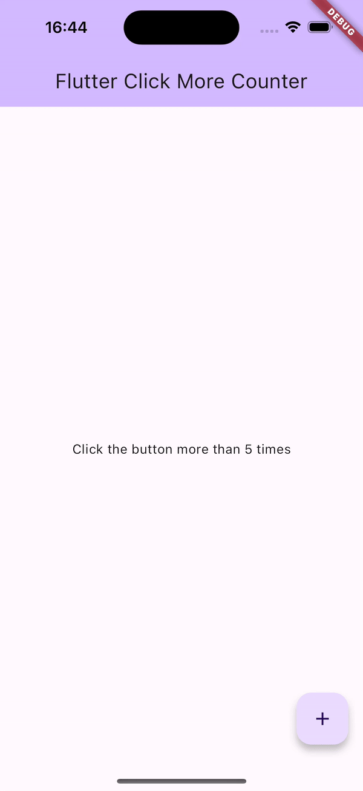

<!--
A click counter that show message to tell the users that they need to click more to continue.
-->

The feature of this lib is the same as active the developer mode in Android devices.



## Features

Use this plugin in your Flutter when:

- Open something hidden in your app that you don't want user to know it.
- You want to open a hidden screen (logs, app information, user information, ...) for tracking
  issues when app in release mode.

## Getting started

Add dependency

### Add dependency
This plugin using FlutterToast to show message, you need add this dependency as well.

```yaml
dependencies:
  flutter:
    sdk: flutter
  # add flutter_screenutil
  flutter_click_more_counter: ^1.0.0
  fluttertoast: ^8.2.4
```

### Add the following imports to your Dart code

```dart
  import 'package:flutter_click_more_counter/flutter_click_more_counter.dart';
```

## Usage

### Create ClickMoreCounter

```dart
  final _clickCounter = ClickMoreCounter();
```

### Call function inside your button click event
```dart
    _clickCounter.run(() { });
```

#### Example
```dart
  void onButtonClick() {
      _clickCounter.run(() {
        // do something
      });
    }
```

## Example

[example demo]()
